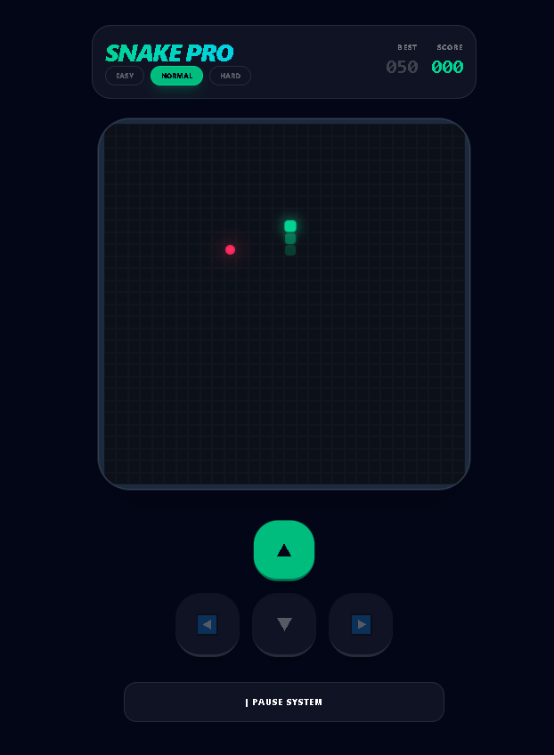

# 🐍 Snake PRO — Optimized Cyberpunk Edition


**Snake PRO** — bu zamonaviy "Cyberpunk Neon" uslubida yaratilgan, yuqori darajada optimallashtirilgan klassik iloncha o'yini. Loyiha React.js va Tailwind CSS yordamida maksimal unumdorlik uchun ishlab chiqilgan.

---

## 📸 Skrinshot (Preview)

<div align="center">
  
  <p><i>Cyberpunk uslubidagi neon interfeys va silliq animatsiyalar</i></p>
</div>


---

## 🔥 Asosiy Xususiyatlari

- **🚀 Performance Optimization:** `useMemo` va `useCallback` hooklari yordamida hatto 30x30 gridda ham 60 FPS silliqlik.
- **🎮 Smart Control:** 
  - Klaviatura (Arrow Keys, WASD) va mobil sensorli tugmalar.
  - **Auto-Resume:** Pauza holatida harakat tugmasini bossangiz, o'yin avtomatik davom etadi.
- **🏆 High Score System:** Sizning eng yaxshi natijangiz brauzerning `localStorage` xotirasida doimiy saqlanadi.
- **⚙️ Difficulty Modes:** 
  - **Easy:** Yangi o'rganuvchilar uchun sekin harakat.
  - **Normal:** Standart o'yin tezligi.
  - **Hard:** Tajribali o'yinchilar uchun ekstremal tezlik.
- **💎 Neon UI:** Shaffof "Glassmorphism" panellari va yashil neon effektlari.

---

## 🛠 Texnologiyalar

- **Frontend:** [React.js](https://reactjs.org)
- **Styling:** [Tailwind CSS](https://tailwindcss.com)
- **State Management:** React Hooks (`useState`, `useEffect`, `useRef`, `useMemo`)
- **Deployment:** GitHub Pages / Vercel

---

## 🚀 O'rnatish va Ishga Tushirish

Loyihani o'z kompyuteringizda ishlatish uchun quyidagi qadamlarni bajaring:

1. **Repozitoriyani klonlash:**
   ```bash
   git clone https://github.com
   cd snakePRO
